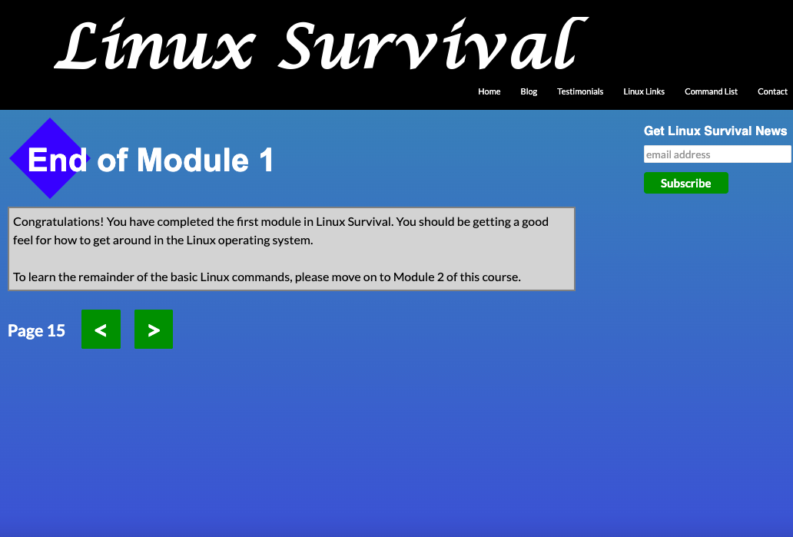
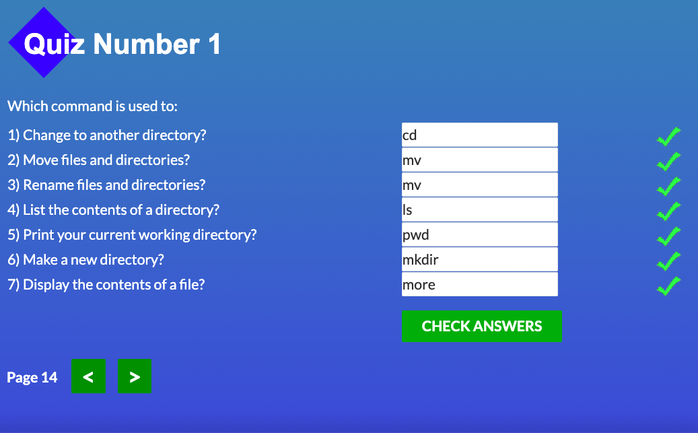
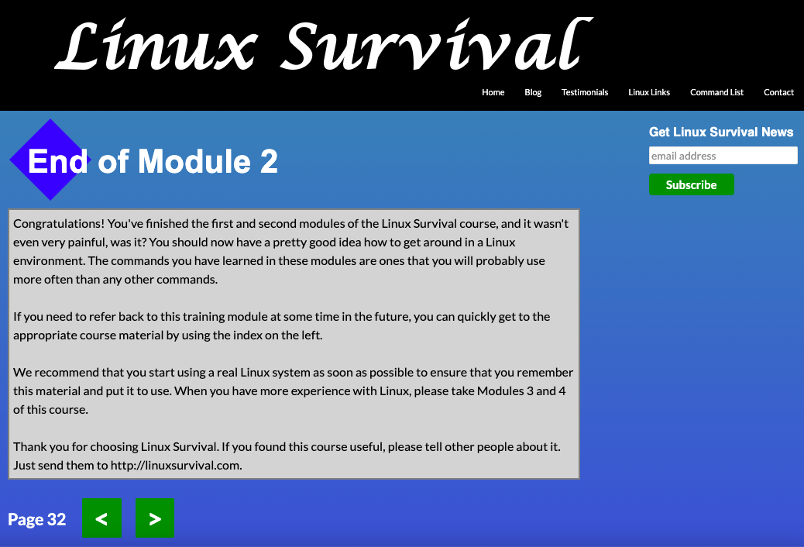
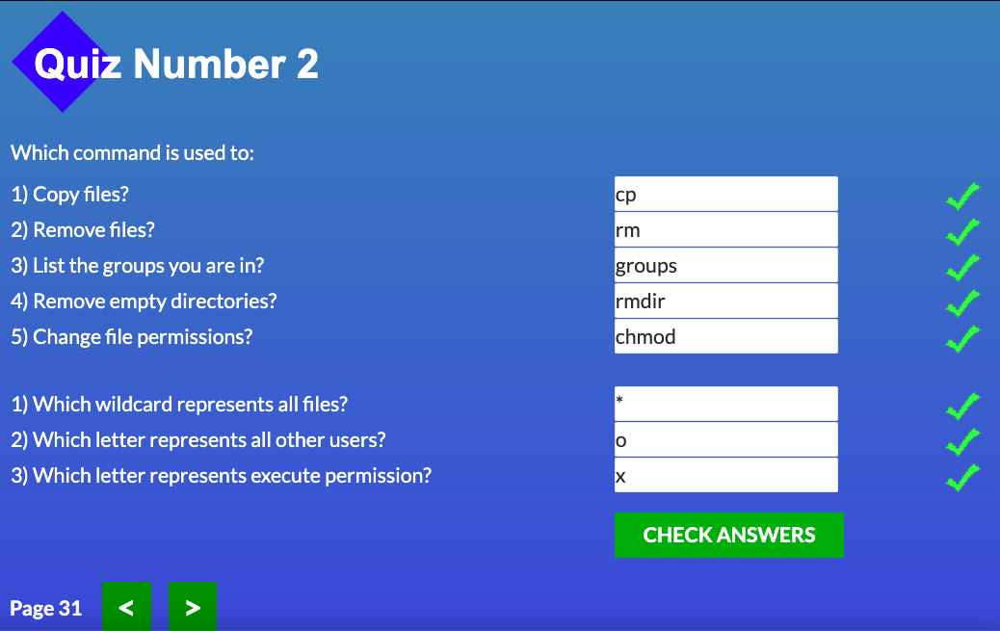
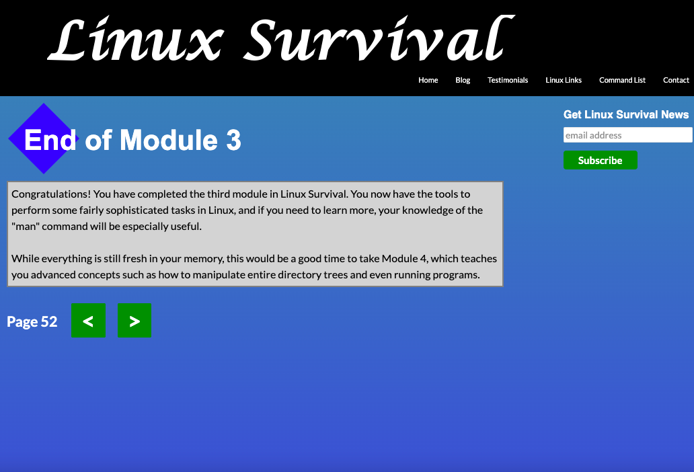
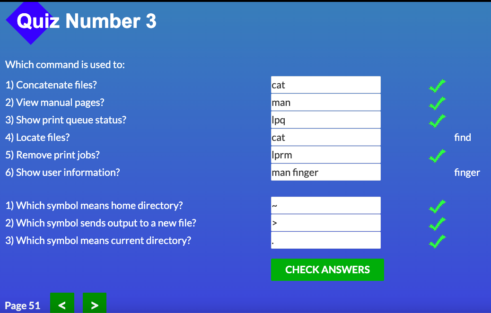
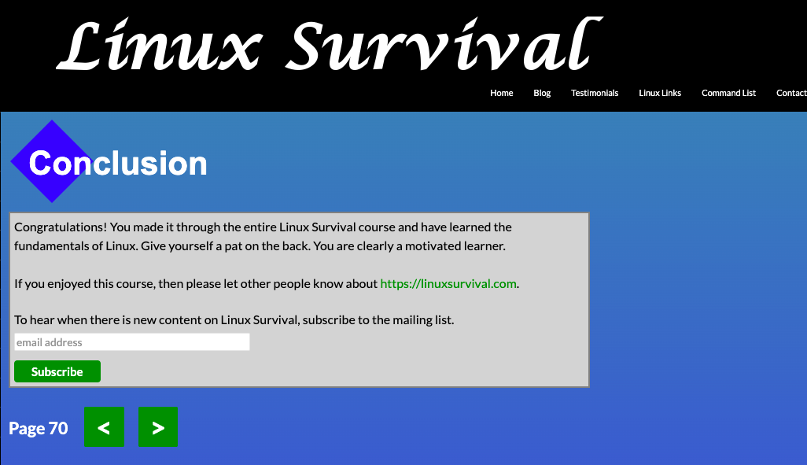
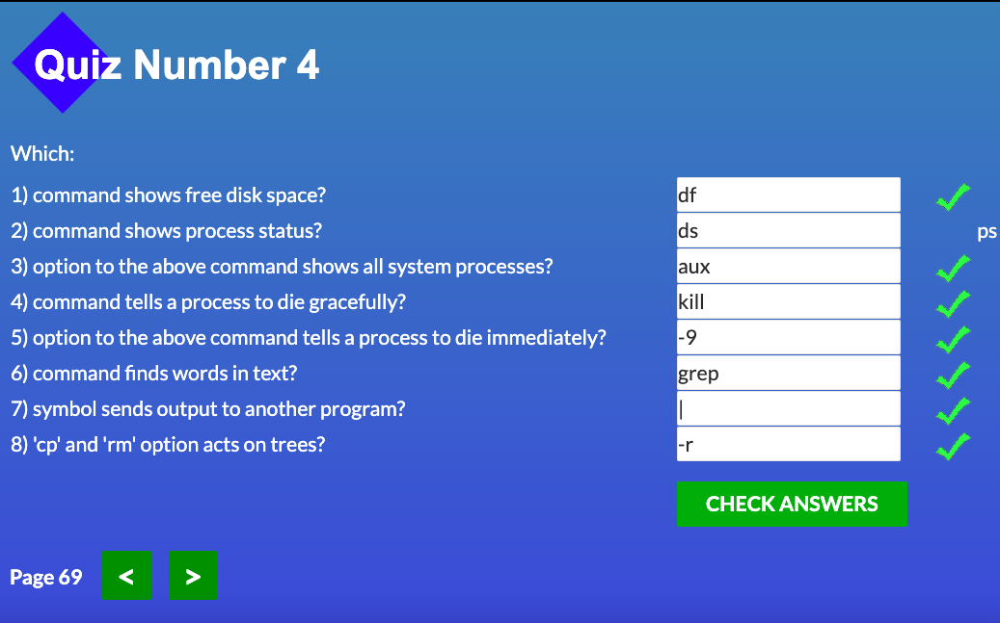

# kottans-frontend
# Stage 0 

General
 

- [X] [Git Basics](https://github.com/kottans/frontend/blob/2022_UA/tasks/git-intro.md)  
- [ ] [Linux CLI and Networking](https://github.com/kottans/frontend/blob/2022_UA/tasks/linux-cli-http.md)  
- [ ] [VCS (hello gitty), GitHub and Collaboration](https://github.com/kottans/frontend/blob/2022_UA/tasks/git-collaboration.md)  

   

Front-End Basic
 

- [ ] [Intro to HTML & CSS](https://github.com/kottans/frontend/blob/2022_UA/tasks/html-css-intro.md)  
- [ ] [Responsive Web Design](https://github.com/kottans/frontend/blob/2022_UA/tasks/html-css-responsive.md)  
- [ ] [HTML & CSS Practice](https://github.com/kottans/frontend/blob/2022_UA/tasks/html-css-popup.md)  
- [ ] [JavaScript Basics](https://github.com/kottans/frontend/blob/2022_UA/tasks/js-basics.md)  
- [ ] [Document Object Model](https://github.com/kottans/frontend/blob/2022_UA/tasks/js-dom.md) 

   

Advanced Topics
  

- [ ] [Building a Tiny JS World](https://github.com/kottans/frontend/blob/2022_UA/tasks/js-pre-oop.md)  
- [ ] [Object oriented JS](https://github.com/kottans/frontend/blob/2022_UA/tasks/js-oop.md)  
- [ ] [OOP exercise](https://github.com/kottans/frontend/blob/2022_UA/tasks/js-post-oop.md)  
- [ ] [Offline Web Applications](https://github.com/kottans/frontend/blob/2022_UA/tasks/app-design-offline.md)  
- [ ] [Memory pair game](https://github.com/kottans/frontend/blob/2022_UA/tasks/memory-pair-game.md)  
- [ ] [Website Performance Optimization](https://github.com/kottans/frontend/blob/2022_UA/tasks/app-design-performance.md)  
- [ ] [Friends App](https://github.com/kottans/frontend/blob/2022_UA/tasks/friends-app.md)  

   

## Git Basics  
Previously I passed a Git course from Udacity so it was easy to pass this one from Coursera. It helped me to refresh my knowledge in Git because i didn't use it since passing the previous one. Also, from this course I learned new information about diff and patch.
After that I consolidated my knowledge with Learn Git Branching course. It was really interesting and even fun to pass every stage :smiley:  
 

Screenshots

  
 

 

  
 

## Linux CLI, and HTTP  

Screenshots

  
 

  
   

  
   

  
    

  
   

  
   

  
    

  
   

  
   

Thanks to Linux Survival course, I learned a lot of commands that will be really helpful for me in using command line. During the first module I found out what I need to do to create directories and files, view theirs contents, move files within directories and rename them, change directory and check what directory I'm currently in.  
Knowledge getting from the second module will allow me to work with command line more effectively and fast. I learned how to avoid extra work by writing a path for commands, how to copy and remove files and directories and some security concepts.  
From the third module I found out what is the home directory and how to get there, learned some information about manual pages, how to find user info and files, how to combine files and send this info to screen, other file or print.  
The fourth module taught me how to copy other owner’s directory to my home directory, remove not empty directory, view statistics of all the discs on my system and particular one, check where the disks reside in my file system tree. Also, I had opportunity to compare Windows and Linux file system structure, got information how to examine running programs, use pipe and grep and kill process.  
Summing up, I find this course useful and I will try to keep in mind all things I found out from it. Also, I must say, that some topics from third and fourth modules were quite challenging for me, while the first and second ones were pretty clear and easy to remember.  
   
I don’t have any technical background, so almost all information in these articles was new for me 🙂  
I understood what are HTTP, HTTPS and TCP protocols, how they work and how URL is built. Furthermore, I found out what is an HTTP requests and responses, how they are built and how they work. Found out what status codes could be and what they mean. I got more understanding how a client and a server cooperate, how connections between them install. I was surprised that there are two types of authentication and that it could be public cache, not only private.  
It’s hard for me to say how I can use this information in progress, but I assume the general understanding of this concept is important. Also, it was interesting to get better understanding of these protocols because I use them on a daily basis.