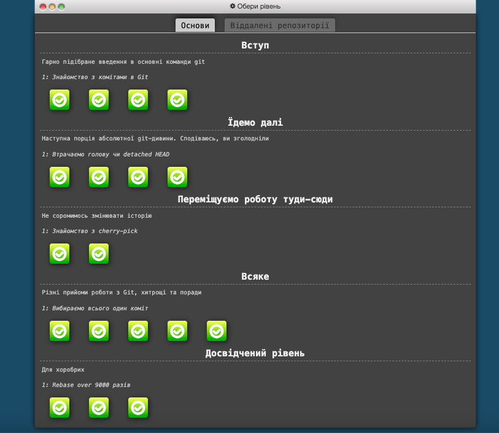
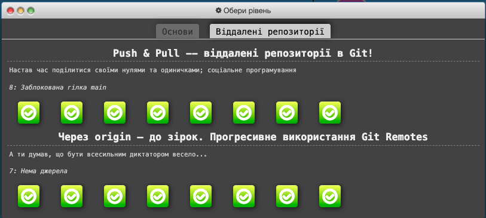

# kottans-frontend
# Stage 0 

General
 

- [X] [Git Basics](https://github.com/kottans/frontend/blob/2022_UA/tasks/git-intro.md)  
- [ ] [Linux CLI and Networking](https://github.com/kottans/frontend/blob/2022_UA/tasks/linux-cli-http.md)  
- [ ] [VCS (hello gitty), GitHub and Collaboration](https://github.com/kottans/frontend/blob/2022_UA/tasks/git-collaboration.md)  

   

Front-End Basic
 

- [ ] [Intro to HTML & CSS](https://github.com/kottans/frontend/blob/2022_UA/tasks/html-css-intro.md)  
- [ ] [Responsive Web Design](https://github.com/kottans/frontend/blob/2022_UA/tasks/html-css-responsive.md)  
- [ ] [HTML & CSS Practice](https://github.com/kottans/frontend/blob/2022_UA/tasks/html-css-popup.md)  
- [ ] [JavaScript Basics](https://github.com/kottans/frontend/blob/2022_UA/tasks/js-basics.md)  
- [ ] [Document Object Model](https://github.com/kottans/frontend/blob/2022_UA/tasks/js-dom.md) 

   

Advanced Topics
  

- [ ] [Building a Tiny JS World](https://github.com/kottans/frontend/blob/2022_UA/tasks/js-pre-oop.md)  
- [ ] [Object oriented JS](https://github.com/kottans/frontend/blob/2022_UA/tasks/js-oop.md)  
- [ ] [OOP exercise](https://github.com/kottans/frontend/blob/2022_UA/tasks/js-post-oop.md)  
- [ ] [Offline Web Applications](https://github.com/kottans/frontend/blob/2022_UA/tasks/app-design-offline.md)  
- [ ] [Memory pair game](https://github.com/kottans/frontend/blob/2022_UA/tasks/memory-pair-game.md)  
- [ ] [Website Performance Optimization](https://github.com/kottans/frontend/blob/2022_UA/tasks/app-design-performance.md)  
- [ ] [Friends App](https://github.com/kottans/frontend/blob/2022_UA/tasks/friends-app.md)  

   

## Git Basics  
Previously I passed a Git course from Udacity so it was easy to pass this one from Coursera. It helped me to refresh my knowledge in Git because i didn't use it since passing the previous one. Also, from this course I learned new information about diff and patch.
After that I consolidated my knowledge with Learn Git Branching course. It was really interesting and even fun to pass every stage :smiley:  
 

Screenshots

  
 

 

